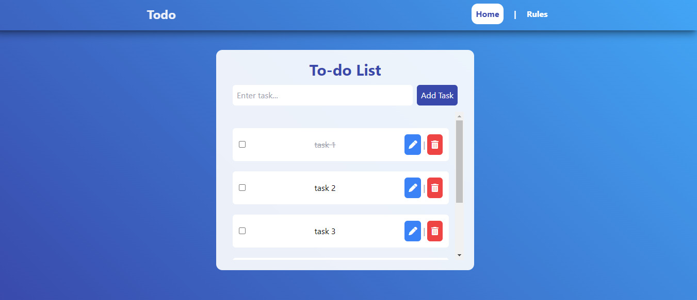

# Todo list App 

# Features

- Interactive UI
- Create using React JS + vite
- Used Tailwind CSS
- Used React Router
- Fully Responsive
- It will save your work progress
- you can add a new upcomming task
- you can edit your task if you do some mistake
- you can delete your task once it is completed
- Or you can mark as complete your task

## Authors

- [@Raktimmaity](https://github.com/Raktimmaity)

## Screenshots

## Demo
https://todolist-raktimmaitys-projects.vercel.app/

## Android Application Comming Soon